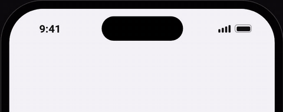

# react-native-island-toast

Toasts that open like the Dynamic Island: a big icon pops in a black square, then the square turns into the message pill. Every color, size, timing and behavior can be changed.

<p align="center">
  
</p>

<p align="center"><a href="media/demo.mp4">Watch the full demo (1 min)</a></p>

- Tiny: about 6 kB minified and gzipped, no dependencies of its own
- iOS, Android and web (react-native-web)
- Built on Reanimated, runs on the UI thread
- Stays above modals and sheets
- Promise toasts, live updates, undo actions
- Light and dark themes, custom types, slots for every part
- RTL, screen readers and reduced motion

## Install

```sh
npm install react-native-island-toast
```

Peer dependencies (most apps already have them):

```sh
npm install react-native-reanimated react-native-safe-area-context
```

Reanimated needs its Babel plugin; Expo sets it up for you.

## Quick start

```tsx
import { IslandHost, island } from 'react-native-island-toast';

export default function App() {
  return (
    <SafeAreaProvider>
      <Navigation />
      <IslandHost />
    </SafeAreaProvider>
  );
}

// anywhere
island.success('Order shipped', { body: 'Arrives Friday' });
```

## API

| Call | Returns | What it does |
| --- | --- | --- |
| `island.success(title, options?)` | `id` | Green tick |
| `island.error(title, options?)` | `id` | Red warning sign |
| `island.info(title, options?)` | `id` | Blue info sign |
| `island.show({ title, type?, ...options })` | `id` | Any type, including your own |
| `island.promise(promise, { loading, success, error })` | the same promise | Spinner, then the result |
| `island.update(id, patch)` | | Changes a message that is showing or waiting |
| `island.dismiss(id)` | | Closes it (unknown ids are ignored) |
| `island.dismissAll()` | | Closes the current one and drops the waiting ones |
| `useIsland()` | `island` + `current` | The same API, plus the message on screen |

### Options for each message

| Option | Type | Default |
| --- | --- | --- |
| `body` | `string` | none |
| `icon` | element or `({ size, color }) => element` | depends on the type |
| `heroIcon` | same as `icon`, shown on the big opening | `icon` |
| `action` | `{ label, onPress, icon? }` | none (with an `icon`, only the icon shows) |
| `duration` | ms of reading time, `Infinity` to keep it | 1600 (3500 with an action) |
| `hero` | `boolean`, show the big icon first | `true` |
| `theme` | partial theme for this message | none |
| `motion` | partial motion for this message | none |
| `haptic` | `false` skips the haptics and sound hooks | `true` |
| `onShow`, `onHide` | `() => void` | none |
| `accessibilityLabel` | `string` | title and body |
| `renderIcon`, `renderTitle`, `renderBody`, `renderAction`, `renderContent` | slots, see below | none |

### Promise toasts

```tsx
island.promise(upload(file), {
  loading: 'Uploading video',
  success: (result) => ({ title: 'Video uploaded', body: result.name }),
  error: (e) => ({ title: 'Upload failed', body: e.message }),
});
```

The returned promise is the one you passed, so `await` and `.catch` work as usual. If the message was dismissed before the promise settles, nothing new appears.

### Undo

```tsx
island.info('Message archived', {
  action: { label: 'Undo', icon: UndoIcon, onPress: restore },
});
```

## Configuration

Wrap your app in `IslandProvider` to change the defaults. Every key is optional.

```tsx
<IslandProvider
  config={{
    preset: 'snappy',
    queue: 'replace-latest',
    position: 'top',
    theme: { radius: 18, fontFamily: 'Inter' },
    darkTheme: { border: 'rgba(255,255,255,0.3)' },
    types: {
      upload: { light: { accent: '#BF5AF2' } },
    },
    haptics: (type) => Haptics.notificationAsync(type === 'error' ? 'error' : 'success'),
  }}
>
  <App />
</IslandProvider>
```

Settings are applied in this order, each one over the previous:

1. Library defaults
2. `config.theme`, then `config.darkTheme` in dark mode
3. `config.types[type].light`, then `.dark` in dark mode
4. The `theme` option of the call

### Behavior

| Key | Values | Default |
| --- | --- | --- |
| `queue` | `'replace-latest'`: the current one closes, the newest waits, older waiting ones are dropped<br>`'queue-all'`: every message shows in turn<br>`'replace-now'`: the new one replaces the current one at once | `'replace-latest'` |
| `position` | `'top'` or `'bottom'` | `'top'` |
| `offset` | extra distance from the edge, in points | `0` |
| `tapToDismiss` | `boolean` | `true` |
| `swipeToDismiss` | `boolean`, toward the edge | `true` |
| `direction` | `'ltr'` or `'rtl'`; follows `I18nManager` when unset | unset |
| `colorScheme` | `'auto'`, `'light'` or `'dark'` | `'auto'` |
| `haptics`, `sound` | `(type) => void` | none |
| `onShow`, `onHide` | `(message) => void` | none |

### Theme

| Key | Default |
| --- | --- |
| `background` | `#0A0A0A` |
| `border` | `rgba(255,255,255,0.10)` (`0.20` in dark mode) |
| `title`, `body` | `#FFFFFF`, `rgba(255,255,255,0.72)` |
| `accent` | success `#34C759`, error `#FF453A`, info `#0A84FF`, loading `#FFFFFF` |
| `iconDisc`, `actionBackground`, `actionText` | from the accent, `#0A0A0A` |
| `pillWidth`, `pillHeight` | `120`, `36` (the resting size it opens from and closes to) |
| `heroSize`, `heroIconSize`, `iconSize` | `116`, `64`, `20` |
| `maxWidth`, `maxWidthRatio` | `560`, `0.95` of the host's width |
| `radius`, `heroRadius` | `22`, `36` |
| `shadow` | a soft drop shadow |
| `fontFamily`, `titleStyle`, `bodyStyle` | none |
| `icon`, `heroIcon` | built-in tick, warning sign, info sign, spinner |

### Motion

| Key | Default |
| --- | --- |
| `hero` | `true` |
| `heroHoldMs` | `900` |
| `readMs`, `readWithActionMs` | `1600`, `3500` |
| `open`, `morph` | `{ type: 'spring', damping: 17, stiffness: 210, mass: 0.9 }` or `{ type: 'timing', duration, easing }` (use `Easing` from Reanimated) |
| `reducedMotion` | `'system'` (fade only when the phone asks for less motion), `'always'` or `'never'` |

Presets: `snappy`, `calm`, `bouncy`, `minimal` (no big icon).

## Slots

Replace any part of the pill. A slot gets `{ message, theme, dismiss }`.

```tsx
island.show({
  title: 'Storage almost full',
  type: 'error',
  renderContent: ({ theme }) => (
    <View style={{ padding: 14, width: 240 }}>
      <Text style={{ color: theme.title }}>Storage 92% full</Text>
      <ProgressBar value={0.92} color={theme.accent} />
    </View>
  ),
});
```

Set a slot in `config` to change it for every message.

## Icons

There is no icon library inside. Pass any element, or a function that gets the size and color:

```tsx
import { Ionicons } from '@expo/vector-icons';

island.success('Table booked', {
  icon: ({ size, color }) => <Ionicons name="restaurant" size={size} color={color} />,
});
```

## Modals and sheets

A React Native `Modal` opens in its own layer. Mount an `IslandHost` inside it as well:

```tsx
<Modal visible={open}>
  <Checkout />
  <IslandHost />
</Modal>
```

Only the newest mounted host draws the island, so it always stays on top. When the modal closes, a message that is showing carries on in the host below without opening again.

## Accessibility

- Every message is announced to screen readers (title, body and action).
- The island is one button that closes it; the action has its own label.
- With reduced motion on, the island fades in and out with no big icon.

## Example app

```sh
yarn
yarn example web     # or: yarn example android / ios
```

## License

MIT
